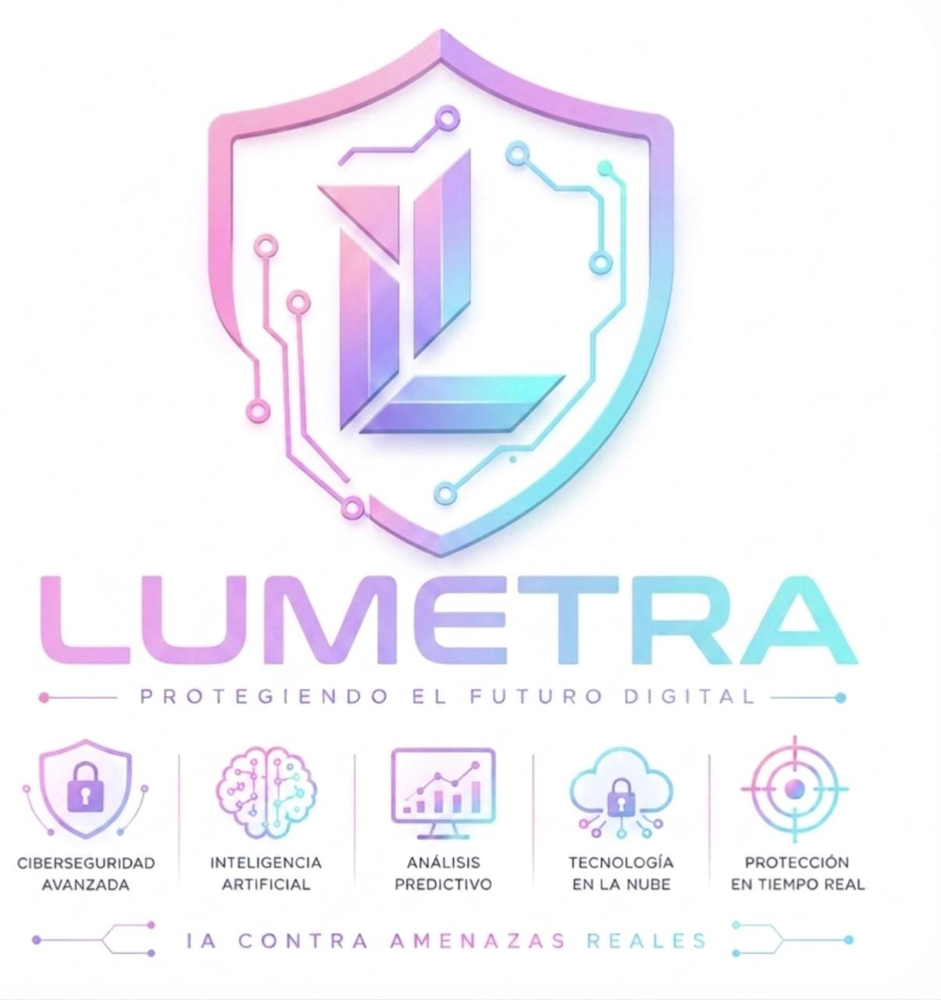

# 🛡️ LUMETRA - Plataforma de Ciberseguridad Inteligente



## Descripción

**LUMETRA** es una plataforma de ciberseguridad revolucionaria que detecta y bloquea amenazas en tiempo real de forma automatizada. Garantizamos protección total 24 horas para tu empresa.

---

## 🎯 El Problema

En la actualidad, las empresas dependen cada vez más de la tecnología y de los sistemas digitales para almacenar información importante, comunicarse y realizar sus operaciones diarias. Sin embargo, este avance también ha incrementado el riesgo de sufrir ataques cibernéticos.

### Desafíos Principales

- **Ataques Cibernéticos Sofisticados**: Muchas organizaciones son víctimas de hackeos, robo de datos, secuestro de información y accesos no autorizados.

- **Sistemas Reactivos**: Los sistemas tradicionales de ciberseguridad actúan de manera reactiva y no preventiva. Las amenazas son detectadas únicamente después de que el ataque ya ocurrió.

- **Borrado de Rastros**: Los ciberdelincuentes eliminan sus rastros digitales mediante técnicas avanzadas, dificultando el rastreo del origen del ataque.

- **Impacto Económico y Reputacional**: Las empresas sufren graves pérdidas económicas por robo de información, interrupciones en servicios y daños en sistemas. Además, los clientes pierden confianza en la organización.

---

## ✨ Nuestra Solución

LUMETRA utiliza tecnología de inteligencia artificial y automatización para:

- ✅ **Detectar amenazas en tiempo real** antes de que causen daño
- ✅ **Bloquear ataques automáticamente** sin intervención manual
- ✅ **Prevenir intrusiones** mediante análisis predictivo
- ✅ **Mantener registros seguros** de todas las actividades del sistema
- ✅ **Identificar comportamientos sospechosos** instantáneamente
- ✅ **Garantizar protección 24/7** sin interrupciones

---

## 🚀 MVP

Puedes explorar nuestro Producto Mínimo Viable (MVP) aquí:
[https://rufoiot.github.io/lumetra-mvp/](https://rufoiot.github.io/lumetra-mvp/)

---

## 📊 Documentación

### Modelo de Negocio
- **Modelo CANVAS**: 

### Documentos Disponibles
- 📄 [README_LUMETRA.pdf](./README_LUMETRA.pdf) - Especificación técnica completa
- 📄 [WHITEPAPER LUMETRA.pdf](./WHITEPAPER%20LUMETRA.pdf) - Análisis técnico y científico
- 📄 [Investigación de Mercado de Lumetra.pdf](./Investigaci%C3%B3n%20de%20Mercado%20de%20Lumetra.pdf) - Análisis de mercado
- 📄 [JUSTIFICACIÓN_ODS LUMETRA.pdf](./JUSTIFICACI%C3%B3N_ODS%20LUMETRA.pdf) - Alineación con Objetivos de Desarrollo Sostenible

### Diseño de Interfaz
- 🎨 [Wireframe 1](./Wireframe%201.jpeg)
- 🎨 [Wireframe 2](./Wireframe%202.jpeg)
- 🎨 [Wireframe 3](./Wireframe%203.jpeg)

---

## 🎨 Componentes del Proyecto

```
├── LOGO_LUMETRA.jpeg              # Identidad visual
├── MODELO CANVAS_LUMETRA.png      # Modelo de negocio
├── CANVAS.jpeg                    # Lienzo estratégico
├── Wireframe 1-3.jpeg             # Prototipos de interfaz
├── README_LUMETRA.pdf             # Documentación técnica
├── WHITEPAPER LUMETRA.pdf         # Análisis científico
├── Investigación de Mercado...pdf # Estudio de mercado
├── JUSTIFICACIÓN_ODS LUMETRA.pdf  # Sostenibilidad
├── Problema                       # Descripción del problema
└── MVP                            # Enlace a MVP
```

---

## 🌍 Sostenibilidad

LUMETRA está comprometido con los Objetivos de Desarrollo Sostenible (ODS). Consulta nuestra justificación en [JUSTIFICACIÓN_ODS LUMETRA.pdf](./JUSTIFICACI%C3%B3N_ODS%20LUMETRA.pdf).

---

## 📈 Investigación de Mercado

Hemos realizado un análisis exhaustivo del mercado de ciberseguridad. Descubre nuestros hallazgos en [Investigación de Mercado de Lumetra.pdf](./Investigaci%C3%B3n%20de%20Mercado%20de%20Lumetra.pdf).

---

## 🔐 Características Principales

- **Detección Inteligente**: Algoritmos de IA que aprenden patrones de ataque
- **Bloqueo Automático**: Respuesta inmediata ante amenazas detectadas
- **Análisis Predictivo**: Prevención proactiva de ciberataques
- **Dashboard en Tiempo Real**: Monitoreo continuo de tu infraestructura
- **Auditoría Completa**: Registro inmutable de todas las actividades
- **Escalabilidad**: Solución adaptable a empresas de cualquier tamaño

---

## 📧 Contacto y Más Información

Para mayor información técnica, consulta nuestra documentación completa:
- Especificaciones técnicas: [README_LUMETRA.pdf](./README_LUMETRA.pdf)
- Detalles científicos: [WHITEPAPER LUMETRA.pdf](./WHITEPAPER%20LUMETRA.pdf)

---

## 📝 Notas

Este proyecto representa la próxima generación en soluciones de ciberseguridad, diseñada para proteger a las organizaciones modernas en un panorama digital cada vez más amenazante.

**Protege tu empresa. Elige LUMETRA. 🛡️**

---

*Última actualización: 2026*
